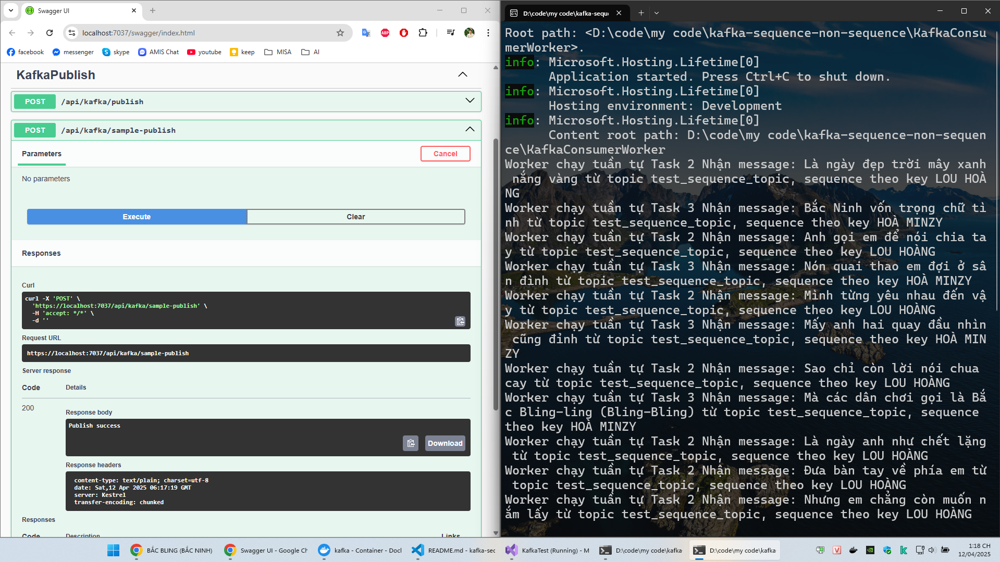

# Project test việc chạy worker lắng nghe queue kafka sequence ( tuần tự) và non sequence ( không tuần tự ) trong cùng 1 pod worker

bước 1: cài docker desktop

bước 2: chạy command docker-compose up trong thư mục [thư mục kafka-docker](kafka-docker)

```
docker-compose -f kafka-docker/docker-compose.yml down && docker-compose -f kafka-docker/docker-compose.yml up -d
```

bước 3: Mở project bằng visual studio, chạy debug cả KafkaConsumerWorker và KafkaPublish.API

với api sampe-pubish, 2 lời bài hát sau được publish liên lục và kết quả console log ở bên dưới

kết quả chạy không tuần tự


kết quả chạy tuần tự


